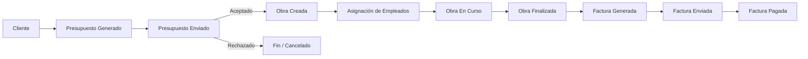
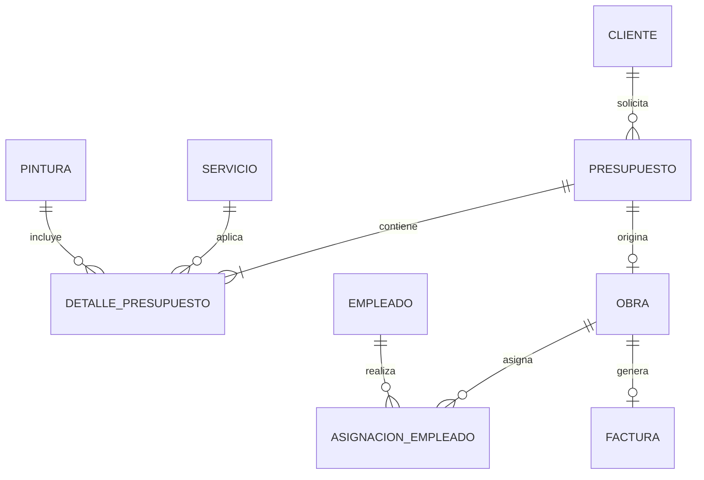

# 🎨 Sistema de Gestión de Empresa de Pintura (PostgreSQL)

[](https://www.postgresql.org/)
[](https://www.postgresql.org/docs/current/plpgsql.html)
[](LICENSE)

Diseño, modelado e implementación de una **base de datos relacional** desarrollada en **PostgreSQL** para la gestión operativa, comercial y financiera de una empresa de servicios de pintura y acondicionamiento de superficies.

El sistema cubre el ciclo completo de gestión: captación de clientes, elaboración de presupuestos detallados, planificación y ejecución de obras, asignación de empleados y gestión de facturas y cobros.

La integridad y coherencia de los datos se refuerzan mediante **funciones y triggers desarrollados en PL/pgSQL**, encargados de automatizar reglas de negocio, controlar transiciones de estado y registrar determinadas fechas de forma automática.

---

## 📑 Tabla de Contenidos

* [Flujo de Negocio](#-flujo-de-negocio)
* [Características Principales](#-características-principales)
* [Modelo Entidad-Relación](#-modelo-entidad-relación)
* [Reglas de Negocio y Triggers](#-reglas-de-negocio-y-triggers)
* [Estructura del Proyecto](#-estructura-del-proyecto)
* [Instalación y Despliegue](#-instalación-y-despliegue)
* [Consultas y Análisis SQL](#-consultas-y-análisis-sql)
* [Documentación Adicional](#-documentación-adicional)

---

## 🔄 Flujo de Negocio

El sistema modela el ciclo de vida de un servicio de pintura desde la gestión inicial del cliente hasta la finalización y facturación de la obra.



---

## 🚀 Características Principales

### 📋 Presupuestación y precios históricos

* Desglose de los trabajos por **estancias**, cantidades y número de capas.
* Catálogo de servicios con tarifa base y unidad de medida.
* Catálogo de pinturas con suplementos asociados.
* Posibilidad de aplicar precios específicos en cada presupuesto.
* Conservación de los precios utilizados en cada detalle mediante:

  * `precio_servicio_aplicado`
  * `suplemento_pintura_aplicado`
* Cálculo automático del importe de cada detalle del presupuesto.
* Los cambios posteriores en las tarifas del catálogo no modifican los precios históricos utilizados en presupuestos anteriores.

### 🏗️ Control operativo de obras

* Una obra únicamente puede crearse cuando el presupuesto asociado ha sido **aceptado**.
* Gestión del ciclo de vida de una obra mediante los estados:

  * `sin_iniciar`
  * `en_curso`
  * `finalizada`
  * `cancelada`
* Registro automático de las fechas de inicio y finalización.
* Asignación de empleados a las obras mediante una relación **N:M** a través de `ASIGNACION_EMPLEADO`.
* Posibilidad de gestionar diferentes asignaciones de empleados a una misma obra.

### 💶 Facturación e integridad financiera

* Una factura únicamente puede generarse para una obra **finalizada**.
* Cálculo automático del importe total a partir de los detalles del presupuesto asociado.
* Gestión del ciclo de cobro mediante los estados:

  * `generada`
  * `enviada`
  * `pagada`
  * `cancelada`
* Registro automático de las fechas de envío y pago.
* Control de determinadas operaciones relacionadas con la reapertura de obras y las facturas existentes.

### ⚙️ Automatización mediante PL/pgSQL

El sistema utiliza **funciones y triggers en PL/pgSQL** para automatizar reglas de negocio y mantener la consistencia de los datos.

Entre sus responsabilidades se encuentran:

* Validación de estados.
* Control de transiciones entre estados.
* Registro automático de fechas.
* Validación de relaciones entre entidades.
* Cálculo automático de importes.
* Control de la relación entre presupuestos, obras y facturas.
* Gestión de facturas cuando una obra vuelve a abrirse.

---

## 📊 Modelo Entidad-Relación

El modelo relacional está compuesto por **9 tablas normalizadas**, conectadas mediante claves primarias y foráneas para garantizar la integridad referencial.



El modelo busca mantener una estructura normalizada, evitando almacenar información redundante y separando las principales áreas funcionales del sistema:

* Gestión de clientes.
* Catálogo de servicios.
* Catálogo de pinturas.
* Presupuestación.
* Ejecución de obras.
* Gestión de empleados.
* Facturación.

---

## ⚙️ Reglas de Negocio y Triggers

El sistema implementa diferentes disparadores para garantizar que las operaciones realizadas sobre la base de datos respeten las reglas de negocio definidas.

| Tabla                 | Trigger                                 | Evento                 | Descripción                                                                                                     |
| --------------------- | --------------------------------------- | ---------------------- | --------------------------------------------------------------------------------------------------------------- |
| `DETALLE_PRESUPUESTO` | `trg_calcular_detalle_presupuesto`      | `BEFORE INSERT`        | Congela los precios aplicados y calcula automáticamente el importe del detalle.                                 |
| `PRESUPUESTO`         | `trg_actualizar_fechas_presupuesto`     | `BEFORE INSERT/UPDATE` | Registra automáticamente las fechas asociadas al envío y respuesta del presupuesto.                             |
| `PRESUPUESTO`         | `trg_validar_estado_presupuesto`        | `BEFORE UPDATE`        | Valida las transiciones de estado y controla las condiciones necesarias para aceptar o rechazar un presupuesto. |
| `OBRA`                | `trg_validar_presupuesto_obra`          | `BEFORE INSERT`        | Impide crear una obra si el presupuesto asociado no está aceptado.                                              |
| `OBRA`                | `trg_validar_estado_obra`               | `BEFORE UPDATE`        | Controla las transiciones válidas entre los estados de una obra.                                                |
| `OBRA`                | `trg_actualizar_fechas_obra`            | `BEFORE INSERT/UPDATE` | Asigna y actualiza automáticamente las fechas de inicio y finalización según el estado de la obra.              |
| `OBRA`                | `trg_gestionar_factura_reapertura_obra` | `AFTER UPDATE`         | Gestiona las facturas existentes cuando una obra finalizada o cancelada vuelve a abrirse.                       |
| `FACTURA`             | `trg_validar_obra_factura`              | `BEFORE INSERT`        | Impide generar una factura si la obra asociada no está finalizada.                                              |
| `FACTURA`             | `trg_calcular_importe_factura`          | `BEFORE INSERT`        | Calcula automáticamente el importe total de la factura a partir de los detalles del presupuesto.                |
| `FACTURA`             | `trg_validar_estado_factura`            | `BEFORE UPDATE`        | Valida las transiciones del ciclo de cobro: `generada → enviada → pagada`.                                      |
| `FACTURA`             | `trg_actualizar_fechas_factura`         | `BEFORE INSERT/UPDATE` | Registra automáticamente las fechas de envío y pago de la factura.                                              |

### Principales reglas de integridad

Entre las reglas implementadas destacan:

1. **Una obra requiere un presupuesto aceptado.**
2. **Una factura requiere una obra finalizada.**
3. **Los estados no pueden modificarse arbitrariamente.**
4. **Las fechas de inicio, finalización, envío y pago se gestionan automáticamente.**
5. **Los precios utilizados en un presupuesto quedan almacenados en el propio detalle.**
6. **El importe de una factura se obtiene a partir de los detalles del presupuesto asociado.**
7. **La reapertura de una obra tiene en cuenta el estado de la factura asociada.**

---

## 📁 Estructura del Proyecto

```text
├── diagrams/
│   ├── modelo_entidad_relacion_empresa_pintura.png
│   └── modelo_entidad_relacion_empresa_pintura.drawio
│
├── docs/
│   ├── 01_memoria_proyecto.md
│   ├── 02_modelo_datos.md
│   ├── 03_implementacion.md
│   ├── 04_reglas_negocio.md
│   └── 05_consultas_analisis.md
│
├── sql/
│   ├── 01_esquema.sql
│   ├── 02_funciones_triggers.sql
│   ├── 03_datos_prueba.sql
│   └── 04_consultas.sql
│
├── LICENSE
│
└── README.md
```

### Descripción de los directorios

#### `diagrams/`

Contiene la documentación gráfica del modelo:

* `modelo_entidad_relacion_empresa_pintura.png`: versión exportada del diagrama E-R.
* `modelo_entidad_relacion_empresa_pintura.drawio`: archivo editable mediante Diagrams.net.

#### `docs/`

Contiene la documentación técnica y funcional del proyecto:

* `01_memoria_proyecto.md`: objetivos, alcance, contexto y limitaciones.
* `02_modelo_datos.md`: descripción de entidades, atributos y relaciones.
* `03_implementacion.md`: decisiones técnicas, DDL y estructura de la base de datos.
* `04_reglas_negocio.md`: reglas de negocio y funcionamiento de los triggers.
* `05_consultas_analisis.md`: catálogo y explicación de las consultas SQL.

#### `sql/`

Contiene los scripts necesarios para construir y utilizar la base de datos:

* `01_esquema.sql`: creación de tablas, claves, restricciones e índices.
* `02_funciones_triggers.sql`: funciones y triggers desarrollados en PL/pgSQL.
* `03_datos_prueba.sql`: datos de prueba coherentes con el modelo.
* `04_consultas.sql`: consultas SQL para explotación y análisis de los datos.

#### `LICENSE`

Contiene los términos de la licencia MIT bajo la que se distribuye el proyecto.

---

## 🛠️ Instalación y Despliegue

### Requisitos previos

* **PostgreSQL 14 o superior**
* Cliente SQL:

  * `psql`
  * **pgAdmin 4**
  * **DBeaver**

### 1. Crear la base de datos

```bash
createdb -U postgres empresa_pintura
```

### 2. Crear el esquema

Ejecutar el script encargado de crear las tablas, claves, restricciones e índices:

```bash
psql -U postgres -d empresa_pintura -f sql/01_esquema.sql
```

### 3. Crear las funciones y triggers

```bash
psql -U postgres -d empresa_pintura -f sql/02_funciones_triggers.sql
```

### 4. Insertar los datos de prueba

```bash
psql -U postgres -d empresa_pintura -f sql/03_datos_prueba.sql
```

### 5. Ejecutar las consultas

```bash
psql -U postgres -d empresa_pintura -f sql/04_consultas.sql
```

### Orden de ejecución

Los scripts deben ejecutarse en el siguiente orden:

```text
01_esquema.sql
      ↓
02_funciones_triggers.sql
      ↓
03_datos_prueba.sql
      ↓
04_consultas.sql
```

Este orden permite respetar las dependencias existentes entre tablas, funciones, triggers y datos.

---

## 🔍 Consultas y Análisis SQL

El proyecto incluye un conjunto de consultas SQL destinadas tanto a comprobar el correcto funcionamiento de la base de datos como a realizar análisis sobre la información almacenada.

Las consultas se organizan en diferentes niveles de dificultad.

### Nivel 1 — Básico

Consultas centradas en:

* Filtros mediante `WHERE`.
* Proyección de columnas.
* Ordenación.
* `JOIN` sencillos.
* Consulta del catálogo de servicios.
* Consulta de clientes.
* Consulta del estado de las obras.

### Nivel 2 — Intermedio

Se incorporan operaciones de agregación y análisis:

* `COUNT()`
* `SUM()`
* `AVG()`
* `GROUP BY`
* `HAVING`
* Cálculo de duraciones.
* Análisis de obras y facturación.

### Nivel 3 — Avanzado

Se utilizan técnicas como:

* Subconsultas.
* Subconsultas correlacionadas.
* Cálculos porcentuales.
* Comparaciones entre clientes.
* Métricas de facturación.
* Análisis de ingresos por periodo.

### Nivel 4 — Análisis avanzado

Se incorporan herramientas de SQL analítico:

* Funciones de ventana.
* `RANK()`.
* `LAG()`.
* `OVER()`.
* `PARTITION BY`.
* Common Table Expressions mediante `WITH`.
* Análisis de tendencias.
* Evolución de la facturación a lo largo del tiempo.

---

## 📖 Documentación Adicional

La documentación técnica del proyecto se encuentra organizada dentro del directorio [`docs/`](docs/).

### 📄 Memoria del proyecto

[**01. Memoria del Proyecto**](docs/01_memoria_proyecto.md)

Descripción general del proyecto, objetivos, alcance, contexto y limitaciones del sistema.

### 📊 Modelo de datos

[**02. Modelo de Datos**](docs/02_modelo_datos.md)

Descripción de las entidades, atributos, claves, relaciones y decisiones tomadas durante el diseño del modelo relacional.

### 🛠️ Implementación

[**03. Implementación**](docs/03_implementacion.md)

Explicación de la implementación de la base de datos en PostgreSQL, incluyendo tipos de datos, restricciones, claves e índices.

### ⚙️ Reglas de negocio

[**04. Reglas de Negocio**](docs/04_reglas_negocio.md)

Descripción detallada de las reglas de negocio implementadas mediante restricciones, funciones y triggers en PL/pgSQL.

### 🔎 Consultas y análisis

[**05. Consultas y Análisis**](docs/05_consultas_analisis.md)

Catálogo de consultas SQL utilizadas para comprobar y explotar la información almacenada en la base de datos.

---

## 🎯 Objetivo del Proyecto

El objetivo principal es diseñar e implementar una **base de datos relacional completa y normalizada** capaz de representar el funcionamiento de una empresa de pintura, aplicando conceptos de:

* Modelado entidad-relación.
* Modelo relacional.
* Normalización.
* Claves primarias y foráneas.
* Restricciones de integridad.
* `CHECK constraints`.
* Consultas SQL.
* Agregaciones.
* Subconsultas.
* CTEs.
* Funciones de ventana.
* PL/pgSQL.
* Funciones almacenadas.
* Triggers.
* Integridad y consistencia de los datos.

El proyecto busca combinar el **diseño correcto de una base de datos** con la aplicación práctica de SQL para la gestión y análisis de información empresarial.

---

## 📌 Alcance y simplificaciones

Para mantener el proyecto acotado y centrado en los objetivos de aprendizaje, el sistema utiliza algunas simplificaciones respecto a una aplicación empresarial real.

Entre ellas:

* No se implementa un sistema de inventario de materiales.
* Se utiliza un único tipo de entidad `CLIENTE` sin diferenciar estructuralmente entre particulares y empresas.
* Se contempla una única factura por obra.
* Los presupuestos no incorporan un sistema completo de versionado histórico.
* Las modificaciones económicas posteriores a la aceptación del presupuesto no se modelan con un sistema específico de anexos o revisiones.

Estas decisiones permiten mantener un modelo manejable y centrado en los fundamentos del diseño relacional y SQL, dejando posibles ampliaciones para futuras versiones del proyecto.

---

## 📜 Licencia

Este proyecto se distribuye bajo la licencia **MIT**.

Consulta el archivo [`LICENSE`](LICENSE) para obtener los términos completos de la licencia.

