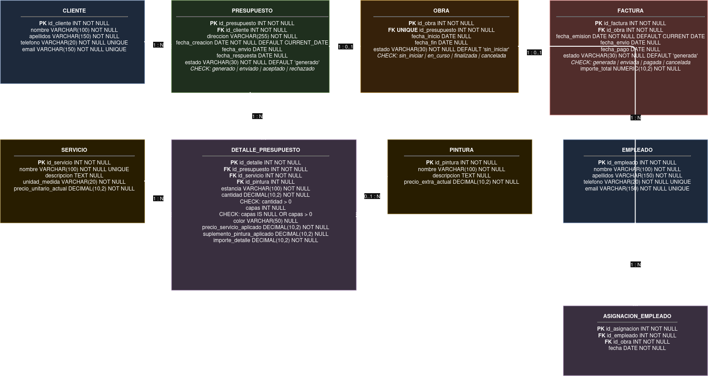

# 2. Modelo de datos

## 2.1. Introducción

La base de datos se ha diseñado siguiendo un modelo relacional, en el que la información se organiza mediante tablas relacionadas entre sí.

El modelo representa las principales entidades que intervienen en la gestión de una empresa de pintura y establece las relaciones necesarias para mantener la integridad de los datos.

Las entidades principales del sistema son:

- Cliente
- Servicio
- Pintura
- Empleado
- Presupuesto
- Detalle_Presupuesto
- Obra
- Asignacion_Empleado
- Factura

Las relaciones entre estas entidades permiten representar el flujo completo desde la creación de un presupuesto hasta la ejecución de la obra y su posterior facturación.

---

## 2.2. Entidades

### 2.2.1. Cliente

La entidad `CLIENTE` almacena la información básica de los clientes de la empresa.

Entre sus principales atributos se encuentran:

- `id_cliente`: identificador único del cliente.
- `nombre`: nombre del cliente.
- `apellidos`: apellidos del cliente.
- `telefono`: número de teléfono.
- `email`: dirección de correo electrónico.

El identificador del cliente constituye la clave primaria de la tabla.

El teléfono y el correo electrónico se mantienen como valores únicos para evitar registrar dos clientes con los mismos datos de contacto.

---

### 2.2.2. Servicio

La entidad `SERVICIO` contiene los diferentes servicios que ofrece la empresa.

Sus principales atributos son:

- `id_servicio`: identificador único del servicio.
- `nombre`: nombre del servicio.
- `descripcion`: descripción del servicio.
- `unidad_medida`: unidad utilizada para medir el servicio.
- `precio_unitario_actual`: precio unitario vigente del servicio.

El precio almacenado en `precio_unitario_actual` representa el precio actual utilizado como referencia para la elaboración de nuevos presupuestos.

---

### 2.2.3. Pintura

La entidad `PINTURA` almacena los tipos de pintura disponibles.

Sus principales atributos son:

- `id_pintura`: identificador único de la pintura.
- `nombre`: nombre o tipo de pintura.
- `precio_extra_actual`: suplemento actual asociado a la pintura.

El suplemento permite incrementar el precio del servicio cuando se selecciona un determinado tipo de pintura.

---

### 2.2.4. Empleado

La entidad `EMPLEADO` contiene la información de los trabajadores de la empresa.

Sus principales atributos son:

- `id_empleado`: identificador único del empleado.
- `nombre`: nombre del empleado.
- `apellidos`: apellidos del empleado.
- `telefono`: teléfono del empleado.
- `email`: email del empleado.

---

### 2.2.5. Presupuesto

La entidad `PRESUPUESTO` representa los presupuestos elaborados para los clientes.

Sus principales atributos son:

- `id_presupuesto`: identificador único del presupuesto.
- `id_cliente`: cliente que solicita el presupuesto.
- `fecha_creacion`: fecha de creación.
- `fecha_envio`: fecha en la que se envía al cliente.
- `fecha_respuesta`: fecha en la que el cliente acepta o rechaza el presupuesto.
- `estado`: estado actual del presupuesto.

Un presupuesto pertenece a un único cliente, mientras que un cliente puede solicitar varios presupuestos.

---

### 2.2.6. Detalle_Presupuesto

La entidad `DETALLE_PRESUPUESTO` permite descomponer un presupuesto en los diferentes servicios que lo forman.

Sus principales atributos son:

- `id_detalle`: identificador único del detalle.
- `id_presupuesto`: presupuesto al que pertenece.
- `id_servicio`: servicio incluido.
- `id_pintura`: pintura seleccionada, cuando corresponda.
- `estancia`: estancia o zona sobre la que se realiza el trabajo.
- `cantidad`: cantidad del servicio.
- `capas`: número de capas, cuando corresponda.
- `color`: color seleccionado, cuando corresponda.
- `precio_servicio_aplicado`: precio del servicio aplicado al presupuesto.
- `suplemento_pintura_aplicado`: suplemento de pintura aplicado.
- `importe_detalle`: importe total del detalle.

Los precios aplicados se almacenan en el propio detalle para conservar el precio utilizado en el momento de elaborar el presupuesto, independientemente de posteriores cambios en los precios actuales de servicios o pinturas.

El importe del detalle se obtiene a partir de la cantidad, el número de capas y los precios aplicados.

---

### 2.2.7. Obra

La entidad `OBRA` representa la ejecución de un presupuesto aceptado.

Sus principales atributos son:

- `id_obra`: identificador único de la obra.
- `id_presupuesto`: presupuesto asociado.
- `fecha_inicio`: fecha de inicio de la obra.
- `fecha_fin`: fecha de finalización.
- `estado`: estado actual de la obra.

Una obra se encuentra asociada a un presupuesto aceptado.

---

### 2.2.8. Asignacion_Empleado

La entidad `ASIGNACION_EMPLEADO` representa la participación de los empleados en las diferentes obras.

Contiene las referencias necesarias para relacionar empleados y obras.

Sus principales atributos son:

- `id_empleado`: empleado asignado.
- `id_obra`: obra a la que se asigna.

Esta entidad permite representar una relación de muchos a muchos entre `EMPLEADO` y `OBRA`, ya que un empleado puede participar en varias obras y una obra puede contar con varios empleados.

---

### 2.2.9. Factura

La entidad `FACTURA` representa la facturación asociada a una obra finalizada.

Sus principales atributos son:

- `id_factura`: identificador único de la factura.
- `id_obra`: obra a la que corresponde.
- `fecha_emision`: fecha de emisión.
- `fecha_envio`: fecha de envío.
- `fecha_pago`: fecha de pago.
- `importe_total`: importe total de la factura.
- `estado`: estado actual de la factura.

La factura se genera a partir de una obra finalizada y su importe total corresponde a los importes de los detalles del presupuesto asociado a dicha obra.

---

## 2.3. Relaciones entre entidades

### Cliente — Presupuesto

Un cliente puede solicitar varios presupuestos, mientras que cada presupuesto pertenece a un único cliente.

**Cardinalidad:**

`CLIENTE (1) ──── (N) PRESUPUESTO`

---

### Presupuesto — Detalle_Presupuesto

Un presupuesto puede estar formado por varios detalles, mientras que cada detalle pertenece a un único presupuesto.

**Cardinalidad:**

`PRESUPUESTO (1) ──── (N) DETALLE_PRESUPUESTO`

---

### Servicio — Detalle_Presupuesto

Un servicio puede aparecer en numerosos detalles de presupuesto, mientras que cada detalle hace referencia a un servicio.

**Cardinalidad:**

`SERVICIO (1) ──── (N) DETALLE_PRESUPUESTO`

---

### Pintura — Detalle_Presupuesto

Una pintura puede utilizarse en diferentes detalles de presupuesto.

La relación es opcional desde `DETALLE_PRESUPUESTO`, ya que no todos los servicios requieren seleccionar una pintura.

**Cardinalidad:**

`PINTURA (1) ──── (N) DETALLE_PRESUPUESTO`

---

### Presupuesto — Obra

Un presupuesto aceptado da lugar a una obra.

**Cardinalidad:**

`PRESUPUESTO (1) ──── (1) OBRA`

La creación de una obra está condicionada a que el presupuesto asociado se encuentre en estado `aceptado`.

---

### Empleado — Obra

Un empleado puede participar en varias obras y una obra puede tener varios empleados asignados.

La relación se implementa mediante la entidad intermedia `ASIGNACION_EMPLEADO`.

**Cardinalidad:**

`EMPLEADO (N) ──── (N) OBRA`

---

### Obra — Factura

Una obra puede tener asociada su factura correspondiente.

En el modelo se establece una única factura por obra.

**Cardinalidad:**

`OBRA (1) ──── (1) FACTURA`

La creación de la factura está condicionada a que la obra se encuentre finalizada.

---

## 2.4. Integridad referencial

Las relaciones entre las entidades se implementan mediante claves foráneas.

Estas claves permiten garantizar que los registros relacionados existan y evitan crear referencias hacia entidades inexistentes.

Por ejemplo:

- Un presupuesto debe hacer referencia a un cliente existente.
- Un detalle de presupuesto debe hacer referencia a un presupuesto y a un servicio existentes.
- Una obra debe hacer referencia a un presupuesto existente.
- Una asignación debe hacer referencia a un empleado y a una obra existentes.
- Una factura debe hacer referencia a una obra existente.

Además de las claves foráneas, la base de datos incorpora restricciones `NOT NULL`, `UNIQUE` y `CHECK` para reforzar la integridad de los datos.

Las reglas de negocio más complejas se implementan mediante funciones y triggers, que se documentarán posteriormente.

---

## 2.5. Diagrama entidad-relación

El modelo entidad-relación del sistema se representa mediante un diagrama que muestra las entidades, sus atributos principales y las relaciones existentes entre ellas.

El diagrama entidad-relación definitivo del proyecto es el siguiente:

 
